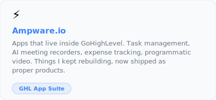
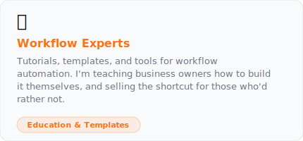
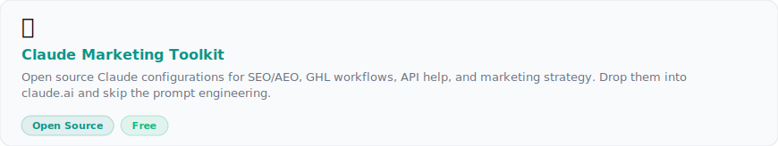

<!-- TYPING SVG -->

<!-- SOCIAL BADGES -->

[![Workflow Experts](https://img.shields.io/badge/Workflow_Experts-f97316?style=for-the-badge&logo=data:image/svg+xml;base64,PHN2ZyB4bWxucz0iaHR0cDovL3d3dy53My5vcmcvMjAwMC9zdmciIHZpZXdCb3g9IjAgMCAyNCAyNCIgZmlsbD0id2hpdGUiPjxwYXRoIGQ9Ik0xOS4xNCAxMi45NGMuMDQtLjMuMDYtLjYxLjA2LS45NCAwLS4zMi0uMDItLjY0LS4wNy0uOTRsMi4wMy0xLjU4YS40OS40OSAwIDAwLjEyLS42MWwtMS45Mi0zLjMyYS40OS40OSAwIDAwLS41OS0uMjJsLTIuMzkuOTZjLS41LS4zOC0xLjAzLS43LTEuNjItLjk0bC0uMzYtMi41NGEuNDg0LjQ4NCAwIDAwLS40OC0uNDFoLTMuODRjLS4yNCAwLS40My4xNy0uNDcuNDFsLS4zNiAyLjU0Yy0uNTkuMjQtMS4xMy41Ny0xLjYyLjk0bC0yLjM5LS45NmEuNDkuNDkgMCAwMC0uNTkuMjJMMi43NCA4Ljg3Yy0uMTIuMjEtLjA4LjQ3LjEyLjYxbDIuMDMgMS41OGMtLjA1LjMtLjA5LjYzLS4wOS45NHMuMDIuNjQuMDcuOTRsLTIuMDMgMS41OGEuNDkuNDkgMCAwMC0uMTIuNjFsMS45MiAzLjMyYy4xMi4yMi4zNy4yOS41OS4yMmwyLjM5LS45NmMuNS4zOCAxLjAzLjcgMS42Mi45NGwuMzYgMi41NGMuMDUuMjQuMjQuNDEuNDguNDFoMy44NGMuMjQgMCAuNDQtLjE3LjQ3LS40MWwuMzYtMi41NGMuNTktLjI0IDEuMTMtLjU2IDEuNjItLjk0bDIuMzkuOTZjLjIyLjA4LjQ3IDAgLjU5LS4yMmwxLjkyLTMuMzJjLjEyLS4yMi4wNy0uNDctLjEyLS42MWwtMi4wMS0xLjU4ek0xMiAxNS42QTMuNiAzLjYgMCAxMTEyIDguNGEzLjYgMy42IDAgMDEwIDcuMnoiLz48L3N2Zz4=&logoColor=white)](https://workflow-experts.com?utm_source=github&utm_medium=readme&utm_campaign=github-profile)

---

<!-- ABOUT -->

# Hey, I'm Mike 👋

I've spent over fifteen years running businesses, not just building systems for them. That changes how I think about problems. I'm not interested in features for the sake of it. I want to know what's actually slowing you down and what would make your life easier if it just worked.

Most of what I build lives behind the scenes. Automations that run while you sleep, integrations that stop you copying and pasting between systems, workflows that turn chaos into something manageable. Not glamorous, but it's the stuff that actually matters.

---

### What I'm Building
<table width="100%">
<tr>
<td width="50%" align="center">
 

 
<a href="https://ampware.io?utm_source=github&utm_medium=readme&utm_campaign=github-profile">Browse Ampware.io →</a>
  
</td>
<td width="50%" align="center">
 

 
<a href="https://workflow-experts.com?utm_source=github&utm_medium=readme&utm_campaign=github-profile">Visit Workflow Experts →</a>
  
</td>
</tr>
<tr>
<td colspan="2" align="center">
 

 
<a href="https://github.com/Workflow-Experts/claude-marketing-toolkit">View on GitHub →</a>
  
</td>
</tr>
</table>

---

### 🔗 Quick Links & Resources

<table>
<tr>
<td width="33%" align="center">

</td>
<td width="33%" align="center">

</td>
<td width="33%" align="center">

</td>
</tr>
</table>

---
 

<b>🛠️ Languages & Tools</b>

 

My go to tech stack choices
 

 
 
Tools I use to make the magic happen
 

 
 
Other things I dabble with
 

 
 
 
Plus some tools that don't have skill icons yet:

 

<b>💼 The Other Stuff</b>

 

I also own a PT academy and I'm helping launch a wellness centre, so I spend half my time in the same trenches as the people I build for. I'm not sat in a home office theorising about what businesses need. I'm running them.

 

